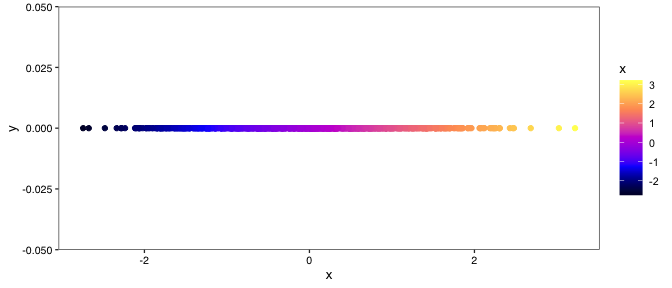
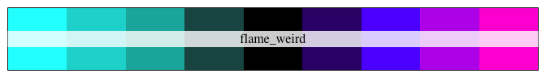

<!-- README.md is generated from README.Rmd. Please edit that file -->
BuenColors
==========

A package that facilitates nice colors created for the [Buenrostro Lab](https://buenrostrolab.com). The base of the package including some divergent color schemes were taken from the [wesanderson](https://github.com/karthik/wesanderson) package. This README provides a quick overview of how to use the color schemes with ggplot2 and which palettes are available.

Installation
------------

``` r
devtools::install_github("caleblareau/BuenColors")
```

Usage
-----

``` r
library(BuenColors)
```

With the library loaded, just type this to get either the `continuous` or `discrete` (by default) palette printed in your `plot` console.

``` r
jdb_palette("FantasticFox")
```


``` r
jdb_palette("aqua_brick", type = "continuous")
```


### Here are all the names that are available...

    #>   [1] "algae_earth"    "aqua_brick"     "aqua_tan"       "berry"         
    #>   [5] "blue_cyan"      "BottleRocket"   "BottleRocket2"  "brewer_blue"   
    #>   [9] "brewer_celsius" "brewer_fire"    "brewer_green"   "brewer_heat"   
    #>  [13] "brewer_jamaica" "brewer_marine"  "brewer_orange"  "brewer_purple" 
    #>  [17] "brewer_red"     "brewer_spectra" "brewer_violet"  "brewer_yes"    
    #>  [21] "calma_azules"   "calma_bosque"   "calma_manudo"   "calma_marino"  
    #>  [25] "calma_morado"   "calma_musgos"   "Cavalcanti"     "Chevalier"     
    #>  [29] "china_basics"   "china_dragon"   "china_novice"   "china_ranges"  
    #>  [33] "china_sunset"   "china_theory"   "china_weirdo"   "citric"        
    #>  [37] "citric_yellow"  "citrus"         "cyan_brick"     "cyan_green"    
    #>  [41] "cyan_pink"      "cyan_purple"    "cyan_tan"       "cyan_violet"   
    #>  [45] "Darjeeling"     "Darjeeling2"    "dark_blue"      "dark_citrus"   
    #>  [49] "dark_cyan"      "dark_violet"    "dusk_dawn"      "FantasticFox"  
    #>  [53] "flame_artic"    "flame_blind"    "flame_flame"    "flame_light"   
    #>  [57] "flame_macaw"    "flame_polar"    "flame_volts"    "flame_watts"   
    #>  [61] "flame_weird"    "flame_wings"    "forest"         "forest_citric" 
    #>  [65] "forest_yellow"  "GrandBudapest"  "GrandBudapest2" "horizon"       
    #>  [69] "horizon_extra"  "Moonrise1"      "Moonrise2"      "Moonrise3"     
    #>  [73] "ocean_aqua"     "ocean_brick"    "ocean_citrus"   "ocean_earth"   
    #>  [77] "ocean_green"    "ocean_pink"     "ocean_red"      "ocean_teal"    
    #>  [81] "purple_baby"    "purple_pink"    "Royal1"         "Royal2"        
    #>  [85] "Rushmore"       "samba_color"    "samba_light"    "samba_night"   
    #>  [89] "solar_basic"    "solar_blues"    "solar_extra"    "solar_flare"   
    #>  [93] "solar_glare"    "solar_rojos"    "teal_orange"    "teal_violet"   
    #>  [97] "white_grove"    "white_jungle"   "white_mango"    "white_orange"  
    #> [101] "white_tango"    "wolfgang_basic" "wolfgang_extra" "Zissou"

Discrete colors
===============

The trick here is to use `scale_color_manual` like it is shown here--

``` r
library(ggplot2)
ggplot(iris, aes(Sepal.Length, Sepal.Width, color = Species)) + 
  geom_point() + theme_bw() + 
  scale_color_manual(values = jdb_palette("brewer_spectra"))
```


Continuous fill
===============

The trick here is to use `scale_color_gradientn` like it is shown here--

``` r
df <- data.frame(x = rnorm(1000), y = 0)
ggplot(df, aes(x=x, y=y, colour=x)) + theme_bw() + geom_point() + 
  scale_color_gradientn(colors = jdb_palette("flame_light"))
```



Continuous Colors
-----------------

Here's what each palette looks like on a continuous scale.


Discrete colors
---------------

Here are the discrete color units that go into each scale. If n is small and discrete, note that the colors that are selected are read from left to right.


