<!-- README.md is generated from README.Rmd. Please edit that file -->
BuenColors
==========

A package that facilitates nice colors created for the Buenrostro Lab. The base of the package including some divergent color schemes were taken from the [wesanderson](https://github.com/karthik/wesanderson) package. This README provides a quick overview of how to use the color schemes with ggplot2 and which palettes are available.

Installation
------------

``` r
devtools::install_github("caleblareau/BuenColors")
```

Usage
-----

``` r
library(BuenColors)
```

Here are all the names that are available
-----------------------------------------

    #>   [1] "algae_earth"    "aqua_brick"     "aqua_tan"       "berry"         
    #>   [5] "blue_cyan"      "BottleRocket"   "BottleRocket2"  "brewer_blue"   
    #>   [9] "brewer_celsius" "brewer_fire"    "brewer_green"   "brewer_heat"   
    #>  [13] "brewer_jamaica" "brewer_marine"  "brewer_orange"  "brewer_purple" 
    #>  [17] "brewer_red"     "brewer_spectra" "brewer_violet"  "brewer_yes"    
    #>  [21] "calma_azules"   "calma_bosque"   "calma_manudo"   "calma_marino"  
    #>  [25] "calma_morado"   "calma_musgos"   "Cavalcanti"     "Chevalier"     
    #>  [29] "china_basics"   "china_dragon"   "china_novice"   "china_ranges"  
    #>  [33] "china_sunset"   "china_theory"   "china_weirdo"   "citric"        
    #>  [37] "citric_yellow"  "citrus"         "cyan_brick"     "cyan_green"    
    #>  [41] "cyan_pink"      "cyan_purple"    "cyan_tan"       "cyan_violet"   
    #>  [45] "Darjeeling"     "Darjeeling2"    "dark_blue"      "dark_citrus"   
    #>  [49] "dark_cyan"      "dark_violet"    "dusk_dawn"      "FantasticFox"  
    #>  [53] "flame_artic"    "flame_blind"    "flame_flame"    "flame_light"   
    #>  [57] "flame_macaw"    "flame_polar"    "flame_volts"    "flame_watts"   
    #>  [61] "flame_weird"    "flame_wings"    "forest"         "forest_citric" 
    #>  [65] "forest_yellow"  "GrandBudapest"  "GrandBudapest2" "horizon"       
    #>  [69] "horizon_extra"  "Moonrise1"      "Moonrise2"      "Moonrise3"     
    #>  [73] "ocean_aqua"     "ocean_brick"    "ocean_citrus"   "ocean_earth"   
    #>  [77] "ocean_green"    "ocean_pink"     "ocean_red"      "ocean_teal"    
    #>  [81] "purple_baby"    "purple_pink"    "Royal1"         "Royal2"        
    #>  [85] "Rushmore"       "samba_color"    "samba_light"    "samba_night"   
    #>  [89] "solar_basic"    "solar_blues"    "solar_extra"    "solar_flare"   
    #>  [93] "solar_glare"    "solar_rojos"    "teal_orange"    "teal_violet"   
    #>  [97] "white_grove"    "white_jungle"   "white_mango"    "white_orange"  
    #> [101] "white_tango"    "wolfgang_basic" "wolfgang_extra" "Zissou"

Discrete colors
===============

The trick here is to use `scale_color_manual` like it is shown here--

``` r
library(ggplot2)
ggplot(iris, aes(Sepal.Length, Sepal.Width, color = Species)) + 
  geom_point() + theme_bw() + 
  scale_color_manual(values = jdb_palette("brewer_spectra"))
```


Continuous fill
===============

The trick here is to use `scale_color_gradientn` like it is shown here--

``` r
df <- data.frame(x = rnorm(1000), y = 0)
ggplot(df, aes(x=x, y=y, colour=x)) + theme_bw() + geom_point() + 
  scale_color_gradientn(colors = jdb_palette("flame_light"))
```


Continuous Colors
-----------------

Here's what each palette looks like on a continuous scale.

``` r
jdb_palette("algae_earth", type = "continuous")
```


``` r
jdb_palette("aqua_brick", type = "continuous")
```


``` r
jdb_palette("aqua_tan", type = "continuous")
```


``` r
jdb_palette("berry", type = "continuous")
```


``` r
jdb_palette("blue_cyan", type = "continuous")
```


``` r
jdb_palette("BottleRocket", type = "continuous")
```


``` r
jdb_palette("BottleRocket2", type = "continuous")
```


``` r
jdb_palette("brewer_blue", type = "continuous")
```


``` r
jdb_palette("brewer_celsius", type = "continuous")
```


``` r
jdb_palette("brewer_fire", type = "continuous")
```


``` r
jdb_palette("brewer_green", type = "continuous")
```


``` r
jdb_palette("brewer_heat", type = "continuous")
```


``` r
jdb_palette("brewer_jamaica", type = "continuous")
```


``` r
jdb_palette("brewer_marine", type = "continuous")
```


``` r
jdb_palette("brewer_orange", type = "continuous")
```


``` r
jdb_palette("brewer_purple", type = "continuous")
```


``` r
jdb_palette("brewer_red", type = "continuous")
```


``` r
jdb_palette("brewer_spectra", type = "continuous")
```


``` r
jdb_palette("brewer_violet", type = "continuous")
```


``` r
jdb_palette("brewer_yes", type = "continuous")
```


``` r
jdb_palette("calma_azules", type = "continuous")
```


``` r
jdb_palette("calma_bosque", type = "continuous")
```


``` r
jdb_palette("calma_manudo", type = "continuous")
```


``` r
jdb_palette("calma_marino", type = "continuous")
```


``` r
jdb_palette("calma_morado", type = "continuous")
```


``` r
jdb_palette("calma_musgos", type = "continuous")
```


``` r
jdb_palette("Cavalcanti", type = "continuous")
```


``` r
jdb_palette("Chevalier", type = "continuous")
```


``` r
jdb_palette("china_basics", type = "continuous")
```


``` r
jdb_palette("china_dragon", type = "continuous")
```


``` r
jdb_palette("china_novice", type = "continuous")
```


``` r
jdb_palette("china_ranges", type = "continuous")
```


``` r
jdb_palette("china_sunset", type = "continuous")
```


``` r
jdb_palette("china_theory", type = "continuous")
```


``` r
jdb_palette("china_weirdo", type = "continuous")
```


``` r
jdb_palette("citric", type = "continuous")
```


``` r
jdb_palette("citric_yellow", type = "continuous")
```


``` r
jdb_palette("citrus", type = "continuous")
```


``` r
jdb_palette("cyan_brick", type = "continuous")
```


``` r
jdb_palette("cyan_green", type = "continuous")
```


``` r
jdb_palette("cyan_pink", type = "continuous")
```


``` r
jdb_palette("cyan_purple", type = "continuous")
```


``` r
jdb_palette("cyan_tan", type = "continuous")
```


``` r
jdb_palette("cyan_violet", type = "continuous")
```

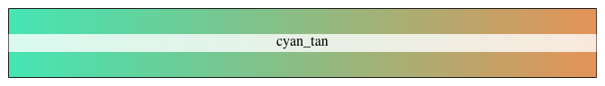

``` r
jdb_palette("Darjeeling", type = "continuous")
```


``` r
jdb_palette("Darjeeling2", type = "continuous")
```


``` r
jdb_palette("dark_blue", type = "continuous")
```


``` r
jdb_palette("dark_citrus", type = "continuous")
```


``` r
jdb_palette("dark_cyan", type = "continuous")
```


``` r
jdb_palette("dark_violet", type = "continuous")
```


``` r
jdb_palette("dusk_dawn", type = "continuous")
```


``` r
jdb_palette("FantasticFox", type = "continuous")
```


``` r
jdb_palette("flame_artic", type = "continuous")
```


``` r
jdb_palette("flame_blind", type = "continuous")
```


``` r
jdb_palette("flame_flame", type = "continuous")
```

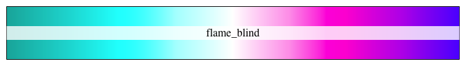

``` r
jdb_palette("flame_light", type = "continuous")
```


``` r
jdb_palette("flame_macaw", type = "continuous")
```


``` r
jdb_palette("flame_polar", type = "continuous")
```


``` r
jdb_palette("flame_volts", type = "continuous")
```


``` r
jdb_palette("flame_watts", type = "continuous")
```


``` r
jdb_palette("flame_weird", type = "continuous")
```

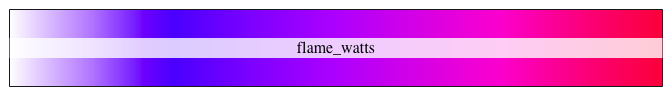

``` r
jdb_palette("flame_wings", type = "continuous")
```

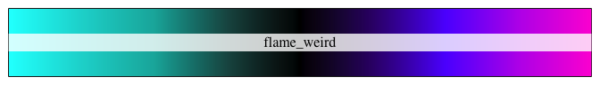

``` r
jdb_palette("forest", type = "continuous")
```

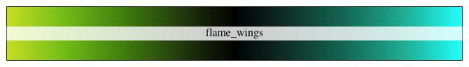

``` r
jdb_palette("forest_citric", type = "continuous")
```


``` r
jdb_palette("forest_yellow", type = "continuous")
```


``` r
jdb_palette("GrandBudapest", type = "continuous")
```


``` r
jdb_palette("GrandBudapest2", type = "continuous")
```


``` r
jdb_palette("horizon", type = "continuous")
```


``` r
jdb_palette("horizon_extra", type = "continuous")
```


``` r
jdb_palette("Moonrise1", type = "continuous")
```


``` r
jdb_palette("Moonrise2", type = "continuous")
```


``` r
jdb_palette("Moonrise3", type = "continuous")
```


``` r
jdb_palette("ocean_aqua", type = "continuous")
```


``` r
jdb_palette("ocean_brick", type = "continuous")
```


``` r
jdb_palette("ocean_citrus", type = "continuous")
```


``` r
jdb_palette("ocean_earth", type = "continuous")
```


``` r
jdb_palette("ocean_green", type = "continuous")
```


``` r
jdb_palette("ocean_pink", type = "continuous")
```


``` r
jdb_palette("ocean_red", type = "continuous")
```


``` r
jdb_palette("ocean_teal", type = "continuous")
```


``` r
jdb_palette("purple_baby", type = "continuous")
```


``` r
jdb_palette("purple_pink", type = "continuous")
```


``` r
jdb_palette("Royal1", type = "continuous")
```


``` r
jdb_palette("Royal2", type = "continuous")
```


``` r
jdb_palette("Rushmore", type = "continuous")
```


``` r
jdb_palette("samba_color", type = "continuous")
```

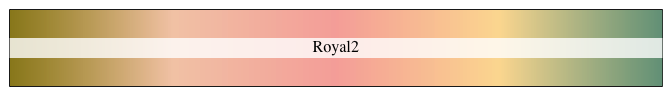

``` r
jdb_palette("samba_light", type = "continuous")
```


``` r
jdb_palette("samba_night", type = "continuous")
```


``` r
jdb_palette("solar_basic", type = "continuous")
```


``` r
jdb_palette("solar_blues", type = "continuous")
```


``` r
jdb_palette("solar_extra", type = "continuous")
```


``` r
jdb_palette("solar_flare", type = "continuous")
```


``` r
jdb_palette("solar_glare", type = "continuous")
```


``` r
jdb_palette("solar_rojos", type = "continuous")
```


``` r
jdb_palette("teal_orange", type = "continuous")
```


``` r
jdb_palette("teal_violet", type = "continuous")
```


``` r
jdb_palette("white_grove", type = "continuous")
```


``` r
jdb_palette("white_jungle", type = "continuous")
```


``` r
jdb_palette("white_mango", type = "continuous")
```


``` r
jdb_palette("white_orange", type = "continuous")
```


``` r
jdb_palette("white_tango", type = "continuous")
```


``` r
jdb_palette("wolfgang_basic", type = "continuous")
```

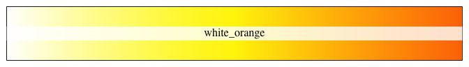

``` r
jdb_palette("wolfgang_extra", type = "continuous")
```

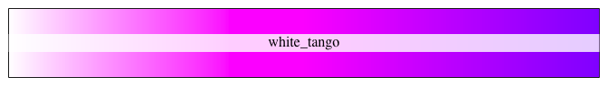

``` r
jdb_palette("Zissou", type = "continuous")
```


Discrete colors
---------------

Here are the discrete color units that go into each scale. If n is small and discrete, note that the colors that are selected are read from left to right.

``` r
jdb_palette("algae_earth")
```


``` r
jdb_palette("aqua_brick")
```


``` r
jdb_palette("aqua_tan")
```

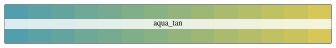

``` r
jdb_palette("berry")
```


``` r
jdb_palette("blue_cyan")
```

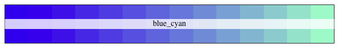

``` r
jdb_palette("BottleRocket")
```


``` r
jdb_palette("BottleRocket2")
```


``` r
jdb_palette("brewer_blue")
```


``` r
jdb_palette("brewer_celsius")
```


``` r
jdb_palette("brewer_fire")
```


``` r
jdb_palette("brewer_green")
```


``` r
jdb_palette("brewer_heat")
```

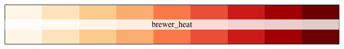

``` r
jdb_palette("brewer_jamaica")
```


``` r
jdb_palette("brewer_marine")
```


``` r
jdb_palette("brewer_orange")
```


``` r
jdb_palette("brewer_purple")
```


``` r
jdb_palette("brewer_red")
```


``` r
jdb_palette("brewer_spectra")
```


``` r
jdb_palette("brewer_violet")
```


``` r
jdb_palette("brewer_yes")
```


``` r
jdb_palette("calma_azules")
```


``` r
jdb_palette("calma_bosque")
```


``` r
jdb_palette("calma_manudo")
```


``` r
jdb_palette("calma_marino")
```


``` r
jdb_palette("calma_morado")
```


``` r
jdb_palette("calma_musgos")
```


``` r
jdb_palette("Cavalcanti")
```


``` r
jdb_palette("Chevalier")
```


``` r
jdb_palette("china_basics")
```


``` r
jdb_palette("china_dragon")
```


``` r
jdb_palette("china_novice")
```


``` r
jdb_palette("china_ranges")
```


``` r
jdb_palette("china_sunset")
```


``` r
jdb_palette("china_theory")
```


``` r
jdb_palette("china_weirdo")
```


``` r
jdb_palette("citric")
```


``` r
jdb_palette("citric_yellow")
```


``` r
jdb_palette("citrus")
```


``` r
jdb_palette("cyan_brick")
```

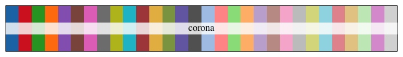

``` r
jdb_palette("cyan_green")
```


``` r
jdb_palette("cyan_pink")
```


``` r
jdb_palette("cyan_purple")
```


``` r
jdb_palette("cyan_tan")
```


``` r
jdb_palette("cyan_violet")
```


``` r
jdb_palette("Darjeeling")
```


``` r
jdb_palette("Darjeeling2")
```


``` r
jdb_palette("dark_blue")
```


``` r
jdb_palette("dark_citrus")
```


``` r
jdb_palette("dark_cyan")
```


``` r
jdb_palette("dark_violet")
```


``` r
jdb_palette("dusk_dawn")
```

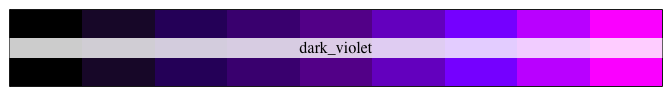

``` r
jdb_palette("FantasticFox")
```


``` r
jdb_palette("flame_artic")
```


``` r
jdb_palette("flame_blind")
```


``` r
jdb_palette("flame_flame")
```


``` r
jdb_palette("flame_light")
```

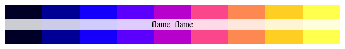

``` r
jdb_palette("flame_macaw")
```

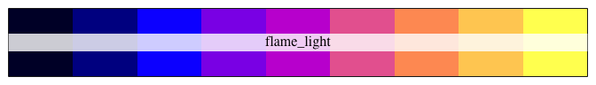

``` r
jdb_palette("flame_polar")
```


``` r
jdb_palette("flame_volts")
```


``` r
jdb_palette("flame_watts")
```


``` r
jdb_palette("flame_weird")
```


``` r
jdb_palette("flame_wings")
```


``` r
jdb_palette("forest")
```


``` r
jdb_palette("forest_citric")
```


``` r
jdb_palette("forest_yellow")
```


``` r
jdb_palette("GrandBudapest")
```


``` r
jdb_palette("GrandBudapest2")
```


``` r
jdb_palette("horizon")
```


``` r
jdb_palette("horizon_extra")
```


``` r
jdb_palette("Moonrise1")
```


``` r
jdb_palette("Moonrise2")
```


``` r
jdb_palette("Moonrise3")
```


``` r
jdb_palette("ocean_aqua")
```


``` r
jdb_palette("ocean_brick")
```

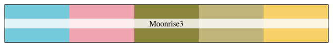

``` r
jdb_palette("ocean_citrus")
```


``` r
jdb_palette("ocean_earth")
```


``` r
jdb_palette("ocean_green")
```


``` r
jdb_palette("ocean_pink")
```


``` r
jdb_palette("ocean_red")
```


``` r
jdb_palette("ocean_teal")
```


``` r
jdb_palette("purple_baby")
```


``` r
jdb_palette("purple_pink")
```


``` r
jdb_palette("Royal1")
```


``` r
jdb_palette("Royal2")
```


``` r
jdb_palette("Rushmore")
```


``` r
jdb_palette("samba_color")
```


``` r
jdb_palette("samba_light")
```


``` r
jdb_palette("samba_night")
```


``` r
jdb_palette("solar_basic")
```


``` r
jdb_palette("solar_blues")
```


``` r
jdb_palette("solar_extra")
```


``` r
jdb_palette("solar_flare")
```


``` r
jdb_palette("solar_glare")
```


``` r
jdb_palette("solar_rojos")
```


``` r
jdb_palette("teal_orange")
```


``` r
jdb_palette("teal_violet")
```


``` r
jdb_palette("white_grove")
```

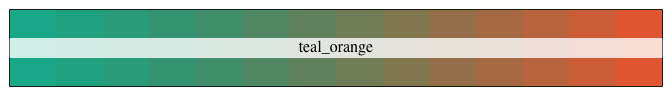

``` r
jdb_palette("white_jungle")
```


``` r
jdb_palette("white_mango")
```


``` r
jdb_palette("white_orange")
```


``` r
jdb_palette("white_tango")
```


``` r
jdb_palette("wolfgang_basic")
```


``` r
jdb_palette("wolfgang_extra")
```


``` r
jdb_palette("Zissou")
```


